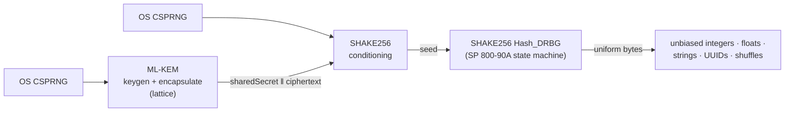

# pqrng

> A post-quantum-only cryptographically secure random number generator. The
> familiar `random*` surface — bytes, integers, ranges, floats, tokens, UUIDs,
> `choice` / `sample` / `shuffle` — powered by a reseedable **SP 800-90A DRBG
> built on the SHAKE256 sponge (FIPS-202)** with an **ML-KEM (FIPS-203)** lattice
> entropy stage. No AES-CTR-DRBG, no truncated-hash DRBG, no classical fallback.

`pqrng` is a small, strict, dependency-light TypeScript library for generating
random values whose **entire cryptographic pipeline is post-quantum**. It keeps
the ergonomics you expect from `Math.random`, `node:crypto`, or a utility
library, and swaps the engine underneath for the same Keccak sponge that the
NIST post-quantum standards are built on.

## Why post-quantum for randomness?

Signatures and key exchange are the headline casualties of a quantum computer,
but a random number generator has a quieter exposure: its unpredictability rests
entirely on the strength of its internal primitive. **Grover's algorithm** gives
a quantum attacker a quadratic speedup on generic search, which _halves_ the
effective bit-strength of a symmetric primitive:

| DRBG core                        | Classical margin | Quantum (Grover) margin |
| -------------------------------- | ---------------- | ----------------------- |
| AES-128-CTR-DRBG                 | 128-bit          | **~64-bit** (weak)      |
| SHA-256 Hash_DRBG                | 256-bit          | ~128-bit                |
| **SHAKE256 DRBG, 512-bit state** | **256-bit**      | **~128-bit** (this lib) |

SHAKE256 is also exactly the extendable-output function (XOF) that **ML-KEM** and
**ML-DSA** use internally, so this generator shares its foundations with the NIST
post-quantum standards rather than bolting on a separate one.

> **The honest scope.** No algorithm — classical or quantum — manufactures
> entropy; every CSPRNG ultimately draws physical randomness from the operating
> system, and so does this one. "Post-quantum only" describes the **cryptographic
> layer**: conditioning, state evolution, and output all run exclusively on
> quantum-resistant primitives, with no weak-Grover-margin component in the path.

## How a value is produced



1. **Entropy** — the operating-system CSPRNG (`crypto.getRandomValues`) is the
   raw source of record. The default source passes it through an **ML-KEM**
   encapsulation and folds the lattice-derived shared secret and ciphertext back
   in with **SHAKE256** — defense-in-depth conditioning through post-quantum
   primitives only.
2. **DRBG** — a faithful **NIST SP 800-90A `Hash_DRBG`** with SHAKE256 standing in
   for the approved hash and its `Hash_df` derivation. A 512-bit working state
   `(V, C, reseed_counter)` evolves with backtracking resistance, and reseeds
   automatically at its interval.
3. **API** — every bounded helper turns uniform bytes into uniform values with
   **rejection sampling**, so integers, ranges, and character choices are free of
   modulo bias.

## Install

```bash
npm install pqrng
```

## Quick start

```ts
import { randomInt, randomString, uuidV4, shuffle } from 'pqrng';

randomInt(1, 7); // a fair d6: an integer in 1..6
randomString(21); // a URL-safe token
uuidV4(); // an RFC 9562 UUIDv4
shuffle(['a', 'b', 'c']); // an unbiased permutation
```

Prefer a single namespace import? The default export bundles everything:

```ts
import pqrng from 'pqrng';

pqrng.randomBytes(32);
pqrng.randomBase64Url(16);
```

### CommonJS

`pqrng` ships **both ESM and CommonJS** builds, so `require` works out of the box
on any Node version — no `import()` gymnastics:

```cjs
const pqrng = require('pqrng');

pqrng.uuid(); // a random UUID (v4)
pqrng.randomInt(1, 7); // a fair d6
pqrng.randomBytes(32); // 32 secure random bytes
```

Named requires work as well: `const { uuid, randomInt } = require('pqrng');`.

## A configured instance

The free functions share one process-wide generator. When you want your own —
a different strength, a custom entropy source, a fixed seed — build one with
`createGenerator`:

```ts
import { createGenerator, Alphabets } from 'pqrng';

const rng = createGenerator({ strength: 192 });

const apiKey = rng.randomBytes(32);
const otp = rng.randomString(6, { alphabet: Alphabets.numeric });
const orderId = rng.uuidV7(); // time-ordered, sorts by creation
```

## Reproducible (deterministic) mode

Pass a fixed `seed` to get a fully reproducible stream — ideal for tests,
simulations, and reproducible sampling. **Never** use it for real secrets.

```ts
import { createGenerator } from 'pqrng';

const seed = new TextEncoder().encode('fixed-test-seed');
const a = createGenerator({ seed });
const b = createGenerator({ seed });

a.randomBytes(16); // identical to…
b.randomBytes(16); // …this
```

## API overview

Every method exists both on a `PostQuantumRandom` instance and as a package-level
free function bound to the shared default generator.

### Bytes & integers

| Method                          | Result                                    |
| ------------------------------- | ----------------------------------------- |
| `randomBytes(length)`           | `Uint8Array` of `length` random bytes     |
| `randomUint32()`                | uniform integer in `0 … 2³² − 1`          |
| `randomBelow(maxExclusive)`     | uniform integer in `[0, max)`             |
| `randomInt(min, max)`           | uniform integer in `[min, max)`           |
| `randomIntInclusive(min, max)`  | uniform integer in `[min, max]`           |
| `randomBigInt(maxExclusive)`    | uniform `bigint` in `[0, max)` (any size) |
| `randomBigIntInRange(min, max)` | uniform `bigint` in `[min, max)`          |

### Floats, booleans, strings

| Method                        | Result                                        |
| ----------------------------- | --------------------------------------------- |
| `randomFloat()`               | double in `[0, 1)` with full 53-bit precision |
| `randomBoolean(p = 0.5)`      | boolean, `true` with probability `p`          |
| `randomString(length, opts?)` | string over an alphabet (default base64url)   |
| `randomHex(byteLength)`       | lowercase hex string                          |
| `randomBase64Url(byteLength)` | unpadded, URL-safe base64url token            |

### Identifiers & collections

| Method                  | Result                                        |
| ----------------------- | --------------------------------------------- |
| `uuidV4()`              | random UUIDv4 (RFC 9562)                      |
| `uuidV7(opts?)`         | time-ordered UUIDv7 (RFC 9562)                |
| `choice(items)`         | one uniformly chosen element                  |
| `sample(items, count)`  | `count` elements, without replacement         |
| `shuffle(items)`        | a new, unbiased permutation (input untouched) |
| `shuffleInPlace(items)` | shuffle in place (Fisher–Yates)               |

### Lifecycle

| Method                     | Result                                    |
| -------------------------- | ----------------------------------------- |
| `reseed(additionalInput?)` | force a reseed with fresh entropy         |
| `stats()`                  | a non-sensitive `GeneratorStats` snapshot |
| `destroy()`                | wipe secret state; subsequent calls throw |

## Security strengths

Three strengths share the **same** SHAKE256 core and 512-bit state; the strength
selects the seeding policy and the ML-KEM parameter set used to condition
entropy. `256` is the default — randomness is cheap and long-lived, so there is
little reason not to take the maximum margin.

| Strength | Entropy per (re)seed | Nonce   | Lattice conditioning |
| -------- | -------------------- | ------- | -------------------- |
| `128`    | 128-bit              | 64-bit  | ML-KEM-512           |
| `192`    | 192-bit              | 96-bit  | ML-KEM-768           |
| `256`    | 256-bit (default)    | 128-bit | ML-KEM-1024          |

## Design notes

- **Unbiased by construction.** All bounded routines funnel through masked
  rejection sampling, terminating in fewer than two draws on average, so the
  distribution is exactly uniform — no modulo skew.
- **Automatic reseeding.** The DRBG reseeds itself at its interval, refreshing
  forward secrecy. You can also `reseed()` explicitly at a trust boundary.
- **Typed errors.** Every failure is a `PqRngError` subclass carrying a stable
  `ErrorCode` (`INVALID_ARGUMENT`, `EMPTY_RANGE`, `RESEED_REQUIRED`, …), so you
  can branch on `.code` instead of parsing messages.
- **Stateless & dependency-light.** Three audited dependencies
  (`@noble/hashes`, `@noble/post-quantum`, `@scure/base`); nothing is persisted.

## Standards

- **FIPS-202** — SHA-3 / SHAKE256 (the XOF at the core).
- **NIST SP 800-90A** — the `Hash_DRBG` construction realized here with SHAKE256.
- **FIPS-203** — ML-KEM, the lattice KEM used for entropy conditioning.
- **RFC 9562** — UUID versions 4 and 7.
- **RFC 4648** — base64url encoding.

## Caveats

This library is engineering built on audited primitives; it has **not** been
independently certified (e.g. CAVP/CMVP) and its SP 800-90A construction is a
SHAKE256 adaptation rather than a validated implementation. For most application
needs — tokens, identifiers, nonces, sampling — it provides a strong,
post-quantum-margin CSPRNG. For FIPS-validated requirements, use a certified
module.

## License

MIT © AgenticValley
